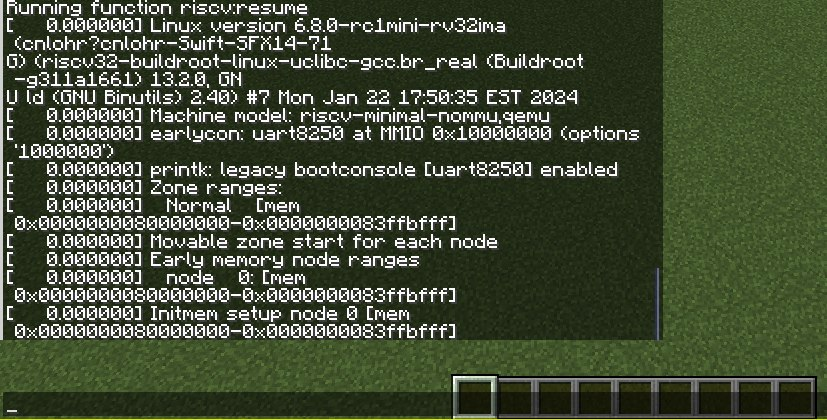

# Linux in Minecraft

This repository hosts the sources and utilities to build a datapack that boots a very minimal Linux image in vanilla Minecraft.

Inspired by [mini-rv32ima](https://github.com/cnlohr/mini-rv32ima), [linux in scratch](https://scratch.mit.edu/projects/892602496), and [linux in a pixel shader](https://blog.pimaker.at/texts/rvc1/).

The code in this repo is very sane, caution is adviced.

Written against Minecraft 1.20.6.

## Useful commands

- `/function riscv:machine_dump_state` prints the current state of the registers, and some other values.
- `/function riscv:resume` starts the emulator.
- `/function riscv:pause` stops the emulator.
- `/function riscv:save` saves the emulator state.
- `/function riscv:restore` restores a previously saved emulator state.

## How?

Its a RISC-V I+M+A+Zicsr+Zifencei emulator written in [cbscript](https://github.com/SethBling/cbscript), a scripting language that compiles relatively normal code to a set of minecraft command functions and places them in a datapack.

Data is mostly stored in scoreboards scores. Scoreboard score values are 32-bit signed integers. Additionally, minecraft allows some [operations](https://minecraft.fandom.com/wiki/Argument_types#operation) on these scores, which allows "relatively" efficient implementation of the emulator. There are only a few operations though, so most of the other ones (bit operations, 64-bit multiply, division, etc) are emulated.

Memory is stored in minecrafts [data storage](https://minecraft.fandom.com/wiki/Commands/data). There is a B-tree of 3 levels of 256 elements, each cell a 32-bit value.

## How to get it?

First, download [cbscript](https://github.com/SethBling/cbscript) and run `python3 /path/to/cbscript/compile.py ./riscv.cbscript`. You will most likely have to replace the `dir` directive in `riscv.cbscript` with the path to the minecraft world that you want to place the datapack in.

Next, you will need to get a linux image and device tree. I'm using the minimal [Linux images made by CNLohr](https://github.com/cnlohr/mini-rv32ima-images) (the 6.8.0 version in the screenshot) and the device tree from CHLohr's [mini-rv32ima](https://github.com/cnlohr/mini-rv32ima/blob/master/mini-rv32ima/sixtyfourmb.dtb). Run `./init_memory_storage.py /path/to.minecraft/saves/yourworld/ --image-path path/to/linux/Image --dtb-path path/to/sixtyfourmb.dtb` to initialize the memory storage.

Finally, load up your world and run `/function riscv:resume` to start the emulator. It might take a while before anything shows up, but the debug scoreboard should indicate that the machine is running.

## Speed?

It seems to be about 700 instructions per second on my machine. The first Linux message appears around 30500 cycles. The image starts up in about 45000000 cycles, so full boot should take about 18 hours. I haven't ran it yet for all that time.

## Project overview

cbscript files:
- `riscv.cbscript` contains the main emulator
- `bit.cblib` contains functions for bit operations
- `print.cblib` contains some hacks to print console messages to the minecraft chat, putc-style.
- `longmath.cblib` contains functions for 64-bit multiplication and unsigned division/remainder.
- `selftest.cblib` has a number of unit tests to verify the implementation of the machine. Its commented out by default because it takes a long time to compile these.
- `memory.cblib` implements the memory storage.

development utilities:
- `flake.nix` and `flake.lock` contain a development environment that set up zig, clang, python, etc.
- `validator.zig` implements a reference emulator using [mini-rv32ima](https://github.com/cnlohr/mini-rv32ima) to verify execution of unit tests.
- `linux_emu.zig` implements a similar emulator used to gather reference traces and states to compare the minecraft emulator's state to.
- `init_memory_storage.py` is used to initialize the datapack's data storage with a linux image.
- `compare_state.py` is used to compare the state of the machine. This accepts a path to your world and automatically loads the data from `/function riscv:save`. Reference traces can be gathered using the `linux_emu.zig`, see the `save()` function.
- `compare_traces.py` can be used to compare traces, from minecraft logs and `machine_dump_state()`. Reference traces are gathered by adding arbitrary calls to DumpState in [mini-rv32ima](https://github.com/cnlohr/mini-rv32ima).
